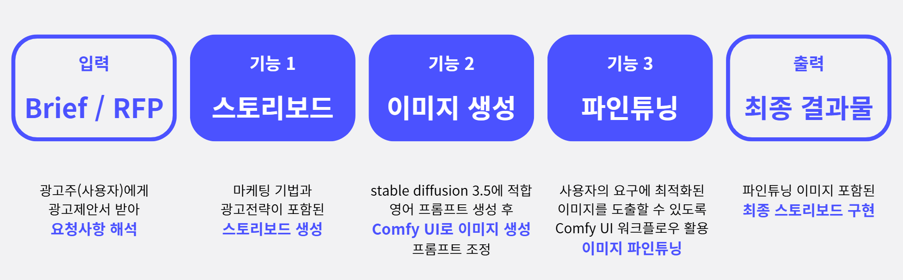
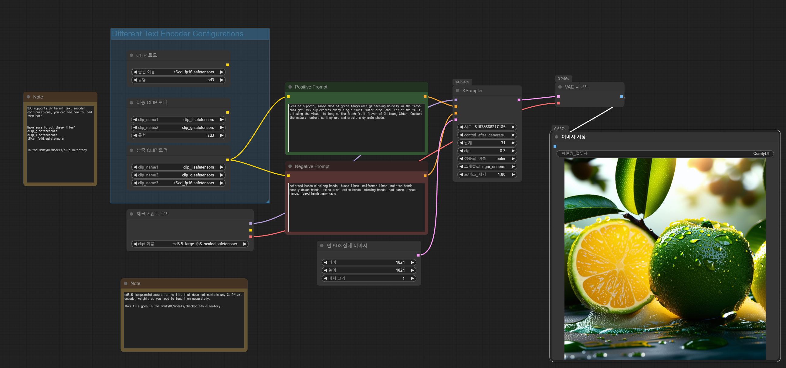
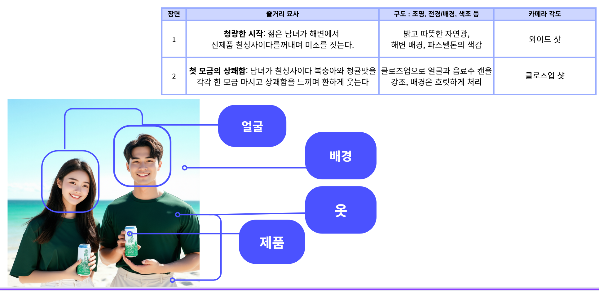
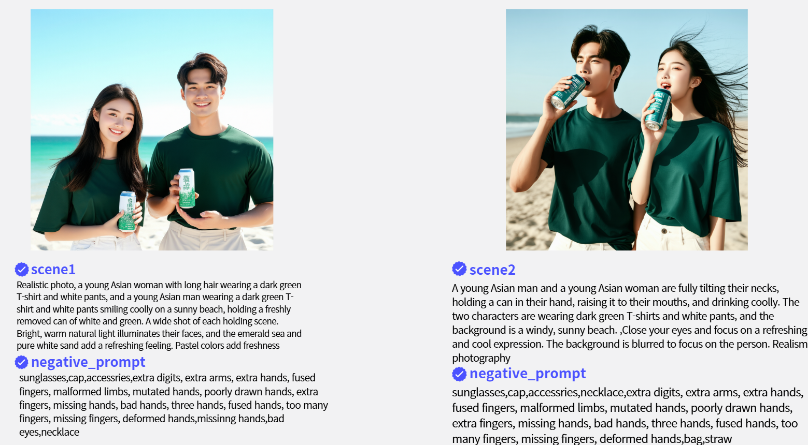
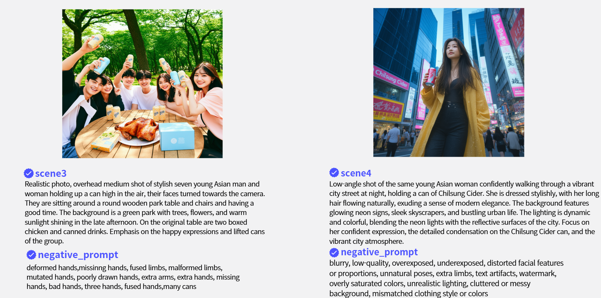
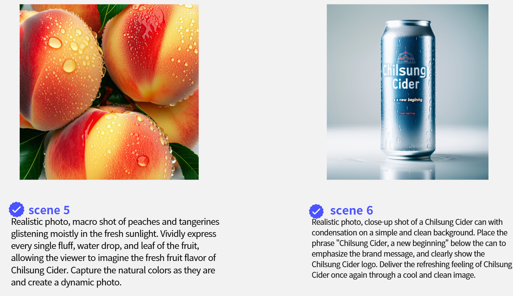
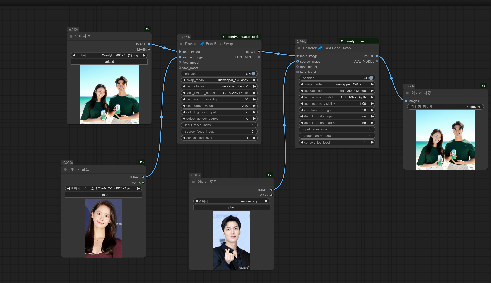
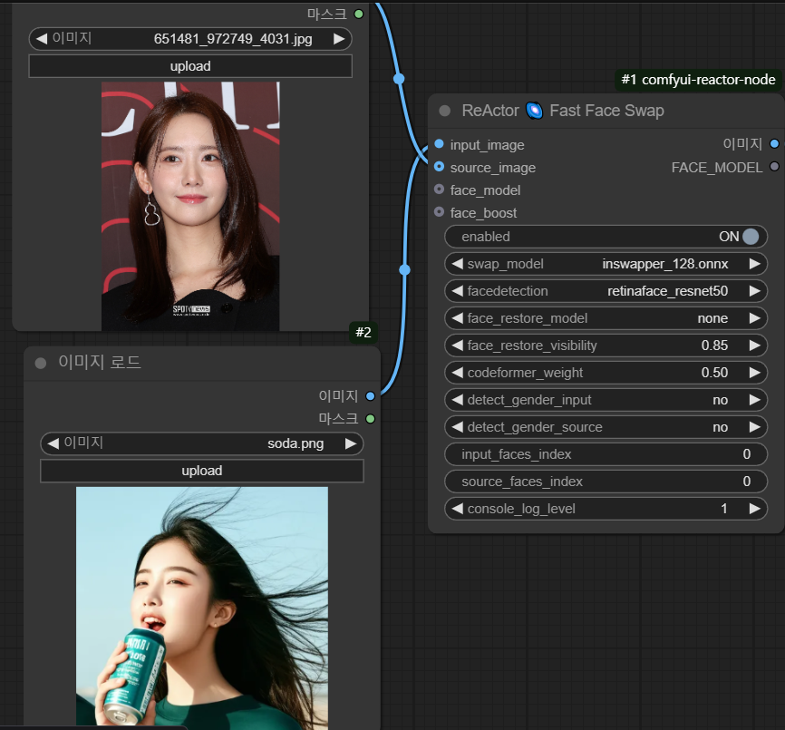
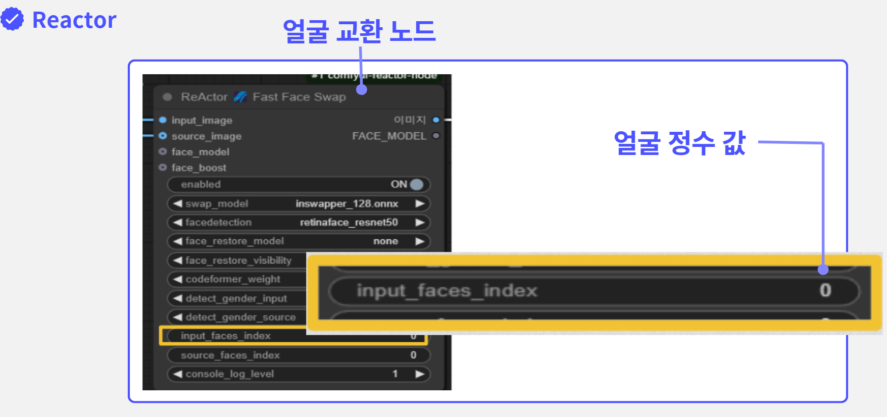

# AI-Canvas:생성혈 AI를 활용한 스토리보드 만들기

## [소개]

>생성형ai를 활용해서 스토리보드를 만들고 이미지 생성하기

## [환경]

LLM모델: Gemini 1.5 pro-001

VM: gcp compute engine 

UI:comfyui 

diffusion model:stable diffusion 3.5,stable diffusion 1.5

## [파일]
[comfyui sd_3.5.json](https://github.com/jinijini20/AI-Canvas/blob/main/comfyui%20workflow/comfyui%20sd_3.5.json) :이미지생성 workflow

[storyboard_eng.pdf](storyboard_eng.pdf) : 스토리보드->stable diffusion 3.5영어프롬프트 시도한파일

[storyboard_kr.pdf](storyboard_kr.pdf) :스토리보드->stable diffusion3.5한국어프롬프트->영어로 번역프롬프트 시도한 파일

[comfyui_옷바꾸기.json](https://github.com/jinijini20/AI-Canvas/blob/main/comfyui%20workflow/comfyui_%EC%98%B7%EB%B0%94%EA%BE%B8%EA%B8%B0.json) :원하는 옷으로 변경하는 workflow

[comfyui_제품.json](https://github.com/jinijini20/AI-Canvas/blob/main/comfyui%20workflow/comfyui_%EC%A0%9C%ED%92%88.json) :원하는 제품으로 변경하는 workflow

[comfyui_제품시도1.json](https://github.com/jinijini20/AI-Canvas/blob/main/comfyui%20workflow/comfyui_%EC%A0%9C%ED%92%88%EC%8B%9C%EB%8F%841.json):원하는 제품으로 변경하는 workflow 시도1

[comfyui_얼굴.json](https://github.com/jinijini20/AI-Canvas/blob/main/comfyui%20workflow/comfyui_%EC%96%BC%EA%B5%B4.json):원하는 얼굴로 변경하는 workflow

## [프로젝트 단계/최종목표]

## [스토리 생성 프롬프트]

브랜드와 시장 현황, 타겟층과 그들의 행동양식, 제품 특징이나 셀링 포인트, 해결과제 등이 포함 된 Brief/RFP문서를 첨부하고 

시스템안내에 콘텐츠 제작/ 마케팅 전문가라는 페르소나를 부여하고 광고의형태와 결과물형식을 지정해줍니다.

## [stable diffusion 3.5 이미지 생성 프롬프트/이미지 생성]

스토리보드의 이미지를 stable diffusion 3.5로 이미지생성하기위한 프롬프트를 생성했습니다.

이 과정에서 저는 스토리보드(장면번호/줄거리/구도/카메라각도)를 입력하면 stable diffusion 3.5영어프롬프트가 나오는 프롬프트[storyboard->ENG](storyboard_eng.pdf)와 
스토리보드(장면번호/줄거리/구도/카메라각도)를 입력하면 stable diffusion 3.5 한글 프롬프트를 출력하고 번역한 프롬프트 [storyboard->KR->ENG](storyboard_kr.pdf)
이 두가지 방법으로 이미지를 생성했습니다.

이 두가지를 시도해본결과 큰차이를 보이지않아 스토리보드(장면번호/줄거리/구도/카메라각도)를 입력하면 stable diffusion3.5 영어 프롬프트로 바로 이미지생성했습니다.

이 이미지는 스토리보드 이미지를생성한  comfyui환경에 stable diffusion3.5 워크플로우입니다.

## [프롬프트 튜닝(Prompt Tuning)]

스토리보드가 스토리에 맞게 이미지가생성되었으나 칠성사이다 스토리보드에서 장면1,장면2가 이어지는 장면인데 일관성이 없이 이미지가생성되어서 얼굴, 배경,옷,제품을 프롬프트로 튜닝을 했습니다.

### 튜닝한결과

   

## [이미지 파인튜닝(Fine Tuning)]

프롬프트 튜닝으로 일관성있게하는데 한계가 있어서 comfyui stable diffusion1.5로 얼굴과 제품을 바꿨습니다.그리고 옷도 sd1.5로 동일하게 바꿀수있는지 시도해봤습니다. 

### ●얼굴

원하는 얼굴로 이미지의 인물들을 바꿔주는데 있어 최적화 된 Fast Swap Face Reactor이라는 노드를 사용하여 우리가 원하는 얼굴로 바꿀 수 있습니다.

다음 그림과 같이 얼굴들이 여러 개 있는 경우, 그림에 있는 각 얼굴에 고유의 숫자를 부여합니다. Fast Swap Face Reactor는 얼굴 하나씩만 바꿀 수 있어, 맨 왼쪽에 있는 그림 같이 두 명 이상의 얼굴들을 바꾸고 싶다면, 얼굴의 개수만큼 Fast Swap Face Reactor 노드를 사용해야 합니다.

### ●제품

