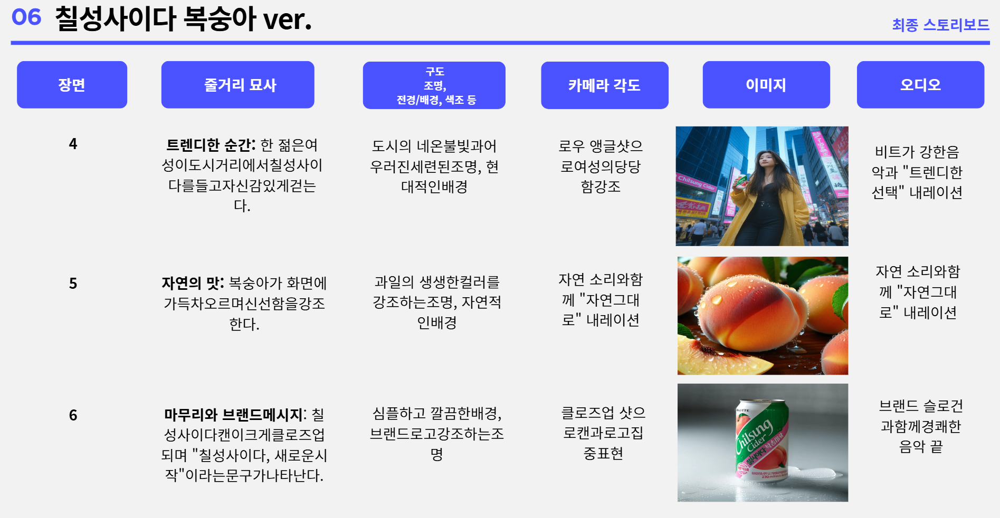

# AI-Canvas:생성혈 AI를 활용한 스토리보드 만들기

## [소개]

>생성형ai를 활용해서 스토리보드를 만들고 이미지 생성하기

## [환경]

LLM모델: Gemini 1.5 pro-001

VM: gcp compute engine 

UI:comfyui 

diffusion model:stable diffusion 3.5,stable diffusion 1.5

## [파일]
[comfyui sd_3.5.json](https://github.com/jinijini20/AI-Canvas/blob/main/comfyui%20workflow/comfyui%20sd_3.5.json) :이미지생성 workflow

[storyboard_eng.pdf](storyboard_eng.pdf) : 스토리보드->stable diffusion 3.5영어프롬프트 시도한파일

[storyboard_kr.pdf](storyboard_kr.pdf) :스토리보드->stable diffusion3.5한국어프롬프트->영어로 번역프롬프트 시도한 파일

[comfyui_옷바꾸기.json](https://github.com/jinijini20/AI-Canvas/blob/main/comfyui%20workflow/comfyui_%EC%98%B7%EB%B0%94%EA%BE%B8%EA%B8%B0.json) :원하는 옷으로 변경하는 workflow

[comfyui_제품.json](https://github.com/jinijini20/AI-Canvas/blob/main/comfyui%20workflow/comfyui_%EC%A0%9C%ED%92%88.json) :원하는 제품으로 변경하는 workflow

[comfyui_얼굴.json](https://github.com/jinijini20/AI-Canvas/blob/main/comfyui%20workflow/comfyui_%EC%96%BC%EA%B5%B4.json):원하는 얼굴로 변경하는 workflow

## [프로젝트 단계/최종목표]

## [스토리 생성 프롬프트]

브랜드와 시장 현황, 타겟층과 그들의 행동양식, 제품 특징이나 셀링 포인트, 해결과제 등이 포함 된 Brief/RFP문서를 첨부하고 

시스템안내에 콘텐츠 제작/ 마케팅 전문가라는 페르소나를 부여하고 광고의형태와 결과물형식을 지정해줍니다.

## [stable diffusion 3.5 이미지 생성 프롬프트/이미지 생성]

스토리보드의 이미지를 stable diffusion 3.5로 이미지생성하기위한 프롬프트를 생성했습니다.

이 과정에서 저는 스토리보드(장면번호/줄거리/구도/카메라각도)를 입력하면 stable diffusion 3.5영어프롬프트가 나오는 프롬프트

[storyboard->ENG](storyboard_eng.pdf)와 스토리보드(장면번호/줄거리/구도/카메라각도)를 입력하면 stable diffusion 3.5 한글 프롬프트를 출력하고 번역한 프롬프트 [storyboard->KR->ENG](storyboard_kr.pdf)

이 두가지 방법으로 이미지를 생성했습니다.

이 두가지를 시도해본결과 큰차이를 보이지않아 스토리보드(장면번호/줄거리/구도/카메라각도)를 입력하면 stable diffusion3.5 영어 프롬프트로 바로 이미지생성했습니다.

이 이미지는 스토리보드 이미지를생성한  comfyui환경에 stable diffusion3.5 워크플로우[comfyui sd_3.5.json](https://github.com/jinijini20/AI-Canvas/blob/main/comfyui%20workflow/comfyui%20sd_3.5.json)입니다.

이 워크플로우에서 KSampler라는 노드의 cfg와 step값을  조정해 이미지를 생성했습니다.

 steps은 몇 차례 수행하며 노이즈를 제거할지 결정하는 값이고 cfg는 입력받은 프롬프트 값을 얼마나 강하게 적용할 것인지를 결정하는 값입니다. 그래서 step을  10으로 했더니 이미지 품질이 떨어지고 이번에는 cfg를  너무 높이 잡아서 이미지가 많이 왜곡되었습니다. 그래서 적절값을 찾아 이미지를 생성했습니다

## [프롬프트 튜닝(Prompt Tuning)]

스토리보드가 스토리에 맞게 이미지가생성되었으나 칠성사이다 스토리보드에서 장면1,장면2가 이어지는 장면인데 일관성이 없이 이미지가생성되어서 얼굴, 배경,옷,제품을 프롬프트로 튜닝을 했습니다.

### 튜닝한결과

   

## [이미지 파인튜닝(Fine Tuning)]

프롬프트 튜닝으로 일관성있게하는데 한계가 있어서 comfyui stable diffusion1.5로 얼굴과 제품을 바꿨습니다.그리고 옷도 sd1.5로 동일하게 바꿀수있는지 시도해봤습니다.

### ●얼굴(Fast Swap Face Reactor) [comfyui_얼굴.json](https://github.com/jinijini20/AI-Canvas/blob/main/comfyui%20workflow/comfyui_%EC%96%BC%EA%B5%B4.json)

원하는 얼굴로 이미지의 인물들을 바꿔주는데 있어 최적화 된 Fast Swap Face Reactor이라는 노드를 사용하여 우리가 원하는 얼굴로 바꿀 수 있습니다.

여러명의 얼굴을 바꾸고자 할때는, 그림에 있는 각 얼굴에 고유의 숫자를 부여합니다. Fast Swap Face Reactor는 얼굴 한명만 바꿀 수 있습니다. 

두 명 이상의 얼굴들을 바꾸고 싶다면,

얼굴의 수만큼 Fast Swap Face Reactor 노드를 추가해야합니다.

### ●제품(inpainting) [comfyui_제품.json](https://github.com/jinijini20/AI-Canvas/blob/main/comfyui%20workflow/comfyui_%EC%A0%9C%ED%92%88.json)

image to image workflow로 inpainting을 해서  제품을 바꿔보았습니다.제품 편집의 핵심은 Flux,Redux 모델입니다.

#### <flux 모델>

   

flux모델은 제품의 특징을 추출한 후, 변환 행렬같은 수학적 기법을 이용해 스토리보드에 맞게 제품을 자동 편집하는 AI 모델입니다.

Flux만 써도 로고나, 곡선 같은 제품의 주 특징들이 잘 반영 되는 반면, 제품의 색상이 변한 것을 볼 수 있습니다 제품의 화질도 기존과 비해 떨어진 것을 볼 수 있습니다.

이를 보완하기 위해 Redux 모델을 추가로 사용했습니다.

#### <redux 모델>

  

Redux 모델은 제품 그림을 스토리보드에 재생산하고 LPIPS라는 추가 평가 지표로 재생성한 그림들 중 제품과 제일 유사한 제품들만 골라냅니다.

Redux 모델은 스타일이나 곡선들을 두드려지게 잘 표현하는 반면, Flux 모델과 비교해서 정확도가 확연히 떨어지는 것을 볼 수 있습니다.

하지만 Flux와 Redux,이 두 모델을 합치면 서로 부족한 면들을 보완하여 이미지를 생성합니다.

#### <flux+redux>

 

제품을 변경하고자하는 이미지에 원하는 제품으로 변경할때 원하는 제품이미지사진의 각도,ROI에 따라 제품이 잘바뀌기도 하고 잘바뀌지않는다 여러방법을 시도해서 제품이 선명하게 잘 변경되는 최적의 방법을 시도했습니다.

#### 각도

위에 보이는 이미지처럼 원본이미지 제품 각도와 비슷하게 제품이미지를 업로드해줘야 더 잘변경되는것을 볼수있습니다.

#### ROI(Region of Interest)

 ROI는 제품을 자동 인식 할 때 생겨나는 현상입니다. 스토리보드에 편집하고자 하는 제품이 하나이면 문제 없지만, 편집하고자 하는 제품이 두 개 이상일 경우, 인식 하고자 하는 영역이 커지므로 생기는 현상입니다. 스토리보드에 편집하고자 하는 제품이 전체 그림 비율에 비해 적은 영역을 차지하면, 한꺼번에 제품들 여러개들을 편집하는 데에 큰 문제가 없지만, 편집하고자 하는 제품간의 길이가 넓어질수록, 제품이 흐릿하게 나오거나 제품을 반영 하지 못하는 현상이 일어났습니다. 저는 최적의 이미지들을 추출하기 위해 제품을 하나씩 수정했습니다

-----
### ●옷(inpainting) [comfyui_옷.json](https://github.com/jinijini20/AI-Canvas/blob/main/comfyui%20workflow/comfyui_%EC%98%B7%EB%B0%94%EA%BE%B8%EA%B8%B0.json)

프롬프트 튜닝을 해서 옷을 일관성있게하지않고 인물이 입고있는 옷으로 일관성있게 옷을 바꿀수있는지 시도해봤습니다.인물이 입고있는옷을 inpainting해서 다른 이미지의 인물이 입고있는 옷으로 바꿔보았습니다.

이미지에서 옷 부분만 분리하기 위한 마스크를 생성하는 과정에서 세그멘테이션 모델을 사용하여 옷 부분을 자동으로 잘 분리하였으나 잘 입혀지지는 않았습니다.

-----

## [최종 결과]

 
 
-----
## [의의/한계]

●기획단계부터 시각화까지 소요되는 인력과 시간을 단축함

●광고주나 서비스이용자가 의도한바를 디테일하게 달성가능

●사용자가 깊은 지식이 있지않아도 효율적이고 적합한 컨텐츠 생산가능

●기획상의 자동화구현 실패

●서비스레이아웃구성필요

